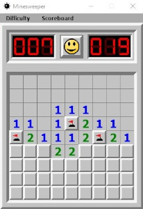
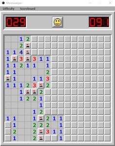
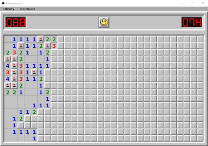
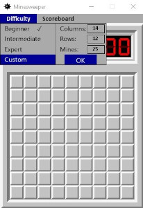
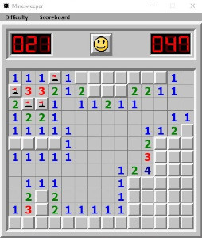

# Minesweeper

## Rules and description

Minesweeper is a classic and simple game, where player needs to locate all
mines in minefield. To do that, one needs to slowly uncover individual
boxes which will usually show a number which indicates how many mines are
hidden in adjacent boxes. Using logic and sometimes a bit of luck one
will uncover all save boxes and mark all boxes which contain mines. You can
watch a small demonstration [here](https://youtu.be/prlptT2zMWg).

There are three basic difficulty settings. With beginner setting you will
be challenged by field of 9x9 boxes where 10 mines are hidden. Intermediate
setting brings field consisting of 16x16 boxes with 40 mines hidden. And 
finally with expert setting you have to deal with field of 30x16 boxes where 
you need to locate 99 mines.   
Beginner difficulty | Intermediate difficulty
:---: | :---:
&nbsp;&nbsp;&nbsp;&nbsp; &nbsp;&nbsp;&nbsp;&nbsp;|&nbsp;&nbsp;&nbsp;&nbsp; &nbsp;&nbsp;&nbsp;&nbsp;   

|**Expert difficulty**|
|:---:|   
|&nbsp;&nbsp;&nbsp;&nbsp;&nbsp;&nbsp;&nbsp;&nbsp;|

If these difficulty modes wouldn't suit you, 
you can use custom setting where you will fill in required number of 
columns, rows and mines. **EACH WRITTEN NUMBER YOU NEED TO CONFIRM BY PRESSING**
**ENTER** otherwise the game wouldn't receive proper data. After filling all three
boxes just click on OK button and game window should be properly recreated 
according to data you provided.
Selecting custom difficulty | New custom difficulty window
:---: | :---:   
&nbsp;&nbsp;&nbsp;&nbsp; &nbsp;&nbsp;&nbsp;&nbsp;|&nbsp;&nbsp;&nbsp;&nbsp; &nbsp;&nbsp;&nbsp;&nbsp;

The left counter shows how many unmarked mines are there left.
Each mine mark (right mouse click) subtracts one from this counter whether
the mine is marked correctly or not (by doing so the counter can even go to 
negative numbers). The right counter tracks passed time from first click into
minefield. The button between these two counters works as a restart button.

Currently is this game fully playable. It should work without any issues.
There is only one thing left to be done and that it tracking scoreboard.
Scoreboard button in menu bar currently does nothing but in a few days
I intend to add functionality for that.

I created this project as learning exercise which should help me to 
strengthen my newly acquired basic knowledge and skills in programming with
Python. The code might not be entirely clear and well organized, however
when reading through it you should keep in mind that this is actually 
very first project completely of my own so when I was writing it, my primary
goal was for it to work properly even if it would look a bit messy. 

## Requirements and installation

Game is developed in Python 3.10.5 (previous versions might work but it has not
been tested and it wasn't created with backward compatibility in mind)

For this game was also used pygame 2.1.2
To install it just type following command to command line:   
```bash
pip install -r requirements.txt
```

To run the game you need to navigate in your command line to directory where
you saved game's files and run minesweeper.py by typing following command:   
```bash
python minesweeper.py
```

## Credits

For the two counters I used DSEG font by Keshikan. Please, visit his [site](https://www.keshikan.net/fonts-e.html?fbclid=IwAR2pAlxONFPeKTU94R9WbG-yGd4wPoZCcvmuJML0WSPjk6863NEsvDsAFTw).

## License

MIT License

Copyright (c) 2022 Stránský Jakub

Permission is hereby granted, free of charge, to any person obtaining a copy
of this software and associated documentation files (the "Software"), to deal
in the Software without restriction, including without limitation the rights
to use, copy, modify, merge, publish, distribute, sublicense, and/or sell
copies of the Software, and to permit persons to whom the Software is
furnished to do so, subject to the following conditions:

The above copyright notice and this permission notice shall be included in all
copies or substantial portions of the Software.

THE SOFTWARE IS PROVIDED "AS IS", WITHOUT WARRANTY OF ANY KIND, EXPRESS OR
IMPLIED, INCLUDING BUT NOT LIMITED TO THE WARRANTIES OF MERCHANTABILITY,
FITNESS FOR A PARTICULAR PURPOSE AND NONINFRINGEMENT. IN NO EVENT SHALL THE
AUTHORS OR COPYRIGHT HOLDERS BE LIABLE FOR ANY CLAIM, DAMAGES OR OTHER
LIABILITY, WHETHER IN AN ACTION OF CONTRACT, TORT OR OTHERWISE, ARISING FROM,
OUT OF OR IN CONNECTION WITH THE SOFTWARE OR THE USE OR OTHER DEALINGS IN THE
SOFTWARE.
